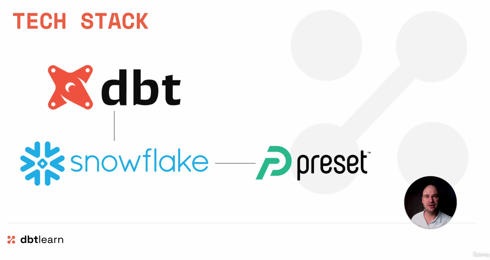

# DbtCourse-Hands-On

This repository contains my hands-on practice and experiments while learning **dbt (data build tool)** with **Snowflake**.

**Become a dbt Professional – Zero to Hero**  
[Become a dbt professional with this ALL-IN-ONE COURSE covering both theory and practice through a real-world project!](https://www.udemy.com/course/complete-dbt-data-build-tool-bootcamp-zero-to-hero-learn-dbt/learn/lecture/52897607#overview)

Instructor: **Zoltan C. Toth**

